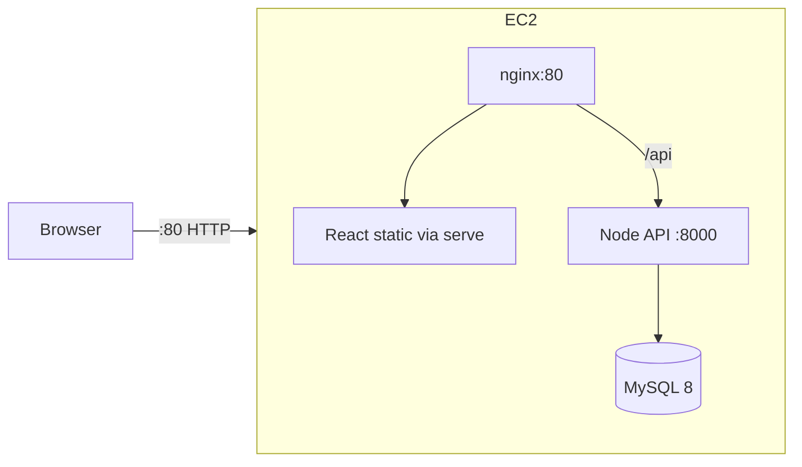

# AWS deployment (Terraform + Learner Lab)

This stack hosts the ecommerce app on a **single EC2 instance** running Docker Compose. It is designed for **AWS Academy Learner Lab** constraints:

- No new IAM roles or policies (LabRole credentials only)
- No RDS, ALB, or NAT Gateway (keeps cost and permissions low)
- Default VPC + security group + EC2 only

## Architecture



| Component | Local (dev) | AWS (prod) |
|-----------|-------------|------------|
| Compose file | `docker-compose.yml` | `docker-compose.aws.yml` |
| Frontend | `npm start` (HMR) | `Dockerfile.prod` → static + `serve` |
| Backend | nodemon | `node index.js` |
| Entry URL | `http://localhost` | `http://<EC2-public-ip>/` |

## Prerequisites

1. **AWS Academy Learner Lab** session started (green status).
2. **Terraform** ≥ 1.5 and **AWS CLI** installed locally or in CloudShell.
3. **EC2 key pair** in the same region as the lab (EC2 → Key Pairs → Create).
4. Lab credentials exported (from **AWS Details** → **AWS CLI**):

```bash
export AWS_ACCESS_KEY_ID="..."
export AWS_SECRET_ACCESS_KEY="..."
export AWS_SESSION_TOKEN="..."
export AWS_DEFAULT_REGION="us-east-1"   # match your lab region
```

Do **not** set `role_arn` / `assume_role` — Learner Lab blocks it.

## Deploy infrastructure

```bash
cd terraform
cp terraform.tfvars.example terraform.tfvars
# Edit: key_name, aws_region, ssh_cidr, db_password

terraform init
terraform plan
terraform apply
```

Note the outputs: `website_url`, `public_ip`, `ssh_command`.

## Deploy application (Ansible + git)

After `terraform apply`, deploy with **Ansible** (installs Docker, clones the repo, starts compose):

```bash
export DB_PASSWORD='YourDbPasswordFromTfvars'
./scripts/ansible-deploy.sh -i ~/.ssh/your-key.pem \
  -r "https://github.com/YOUR_USER/Ecommerce-mini-project.git"
```

Or push to `main`/`master` and let **GitHub Actions** run the same playbook — see [.github/DEPLOY.md](../.github/DEPLOY.md) (secrets: `EC2_HOST`, `EC2_SSH_PRIVATE_KEY`, `DB_PASSWORD`).

First deploy can take **10–20 minutes** (Docker pull + builds + MySQL init).

## Verify

1. Open `http://<public_ip>/` in a browser.
2. Register or log in (seed data from `seed.sql` if loaded).
3. On the instance: `docker compose -f docker-compose.aws.yml ps`

## Learner Lab notes

- **Session limit**: instances stop when lab credits/session end; data on the instance may be lost unless you snapshot EBS (if allowed).
- **Instance size**: default `t3.small`; use at least this for MySQL + Node + React builds.
- **SSH**: set `ssh_cidr` to your public IP `/32` when possible.
- **Terraform AccessDenied**: refresh lab credentials; ensure you are not creating IAM resources in other modules.
- **Stop resources** when finished: `terraform destroy` and terminate stray resources in the EC2 console.

## GitHub Actions (CI/CD)

After EC2 is running, configure deploy secrets and push to `main` / `master`. See **[.github/DEPLOY.md](../.github/DEPLOY.md)**.

## Starting over (full reset)

1. **Destroy AWS** (with fresh Learner Lab credentials):
   ```bash
   cd terraform
   terraform destroy
   ```
   Confirm in the EC2 console that no `ecommerce-*` instance remains.

2. **Start a new lab session** → copy new `AWS_ACCESS_KEY_ID`, `AWS_SECRET_ACCESS_KEY`, `AWS_SESSION_TOKEN`, and region.

3. **Recreate key pair** in EC2 console if the lab account was reset (download new `.pem`).

4. **Apply again**:
   ```bash
   terraform init
   terraform apply
   ```
   Note the new `public_ip`.

5. **Update GitHub secrets** `EC2_HOST` (and `EC2_SSH_PRIVATE_KEY` if you created a new key).

6. **Deploy the app** — **Actions → Deploy to EC2 → Run workflow**, or `./scripts/ansible-deploy.sh` (see above).

7. Open `http://<new-public-ip>/`.

Local Terraform state stays in `terraform/`; you do not need to delete it unless you change AWS accounts.

## Files

| Path | Purpose |
|------|---------|
| `terraform/main.tf` | EC2, security group, default VPC |
| `terraform/user_data.sh.tpl` | Minimal bootstrap (`/opt/ecommerce`) |
| `ansible/` | Docker + git deploy + compose (CI and manual) |
| `docker-compose.aws.yml` | Production compose |
| `nginx/nginx.aws.conf` | Reverse proxy `/` and `/api` |
| `frontend/Dockerfile.prod` | React production build |
| `backend/Dockerfile.prod` | Node production server |
