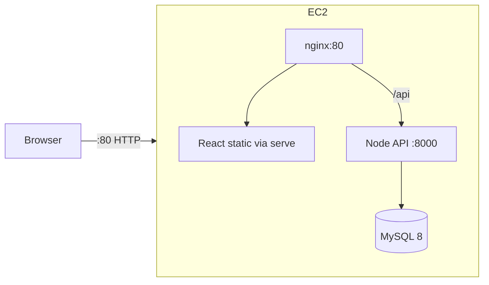

# AWS deployment (Terraform + Learner Lab)

This stack hosts the ecommerce app on a **single EC2 instance** running Docker Compose. It is designed for **AWS Academy Learner Lab** constraints:

- No new IAM roles or policies (LabRole credentials only)
- No RDS, ALB, or NAT Gateway (keeps cost and permissions low)
- Default VPC + security group + EC2 only

## Architecture



| Component | Local (dev) | AWS (prod) |
|-----------|-------------|------------|
| Compose file | `docker-compose.yml` | `docker-compose.aws.yml` |
| Frontend | `npm start` (HMR) | `Dockerfile.prod` → static + `serve` |
| Backend | nodemon | `node index.js` |
| Entry URL | `http://localhost` | `http://<EC2-public-ip>/` |

## Prerequisites

1. **AWS Academy Learner Lab** session started (green status).
2. **Terraform** ≥ 1.5 and **AWS CLI** installed locally or in CloudShell.
3. **EC2 key pair** in the same region as the lab (EC2 → Key Pairs → Create).
4. Lab credentials exported (from **AWS Details** → **AWS CLI**):

```bash
export AWS_ACCESS_KEY_ID="..."
export AWS_SECRET_ACCESS_KEY="..."
export AWS_SESSION_TOKEN="..."
export AWS_DEFAULT_REGION="us-east-1"   # match your lab region
```

Do **not** set `role_arn` / `assume_role` — Learner Lab blocks it.

## Deploy infrastructure

```bash
cd terraform
cp terraform.tfvars.example terraform.tfvars
# Edit: key_name, aws_region, ssh_cidr, db_password

terraform init
terraform plan
terraform apply
```

Note the outputs: `website_url`, `public_ip`, `ssh_command`.

## Deploy application (if `github_repo_url` is empty)

From the project root on your machine:

```bash
export EC2_IP="$(cd terraform && terraform output -raw public_ip)"
scp -i ~/.ssh/your-key.pem -r . ec2-user@"$EC2_IP":/opt/ecommerce/app
ssh -i ~/.ssh/your-key.pem ec2-user@"$EC2_IP" <<'REMOTE'
cd /opt/ecommerce/app
export DB_PASSWORD='YourDbPasswordFromTfvars'
export CORS_ORIGINS="http://$(curl -fsS http://169.254.169.254/latest/meta-data/public-ipv4)"
docker compose -f docker-compose.aws.yml up -d --build
REMOTE
```

Or use the helper script:

```bash
./scripts/deploy-aws.sh -i ~/.ssh/your-key.pem
```

First boot can take **5–15 minutes** (Docker pull + `npm ci` + MySQL init).

## Verify

1. Open `http://<public_ip>/` in a browser.
2. Register or log in (seed data from `seed.sql` if loaded).
3. On the instance: `docker compose -f docker-compose.aws.yml ps`

## Learner Lab notes

- **Session limit**: instances stop when lab credits/session end; data on the instance may be lost unless you snapshot EBS (if allowed).
- **Instance size**: default `t3.small`; use at least this for MySQL + Node + React builds.
- **SSH**: set `ssh_cidr` to your public IP `/32` when possible.
- **Terraform AccessDenied**: refresh lab credentials; ensure you are not creating IAM resources in other modules.
- **Stop resources** when finished: `terraform destroy` and terminate stray resources in the EC2 console.

## Optional: auto-clone on boot

Set in `terraform.tfvars`:

```hcl
github_repo_url = "https://github.com/YOUR_USER/Ecommerce-mini-project.git"
```

The repo must be **public**, or use manual `scp` deploy.

## Files

| Path | Purpose |
|------|---------|
| `terraform/main.tf` | EC2, security group, default VPC |
| `terraform/user_data.sh.tpl` | Installs Docker + optional git clone |
| `docker-compose.aws.yml` | Production compose |
| `nginx/nginx.aws.conf` | Reverse proxy `/` and `/api` |
| `frontend/Dockerfile.prod` | React production build |
| `backend/Dockerfile.prod` | Node production server |
